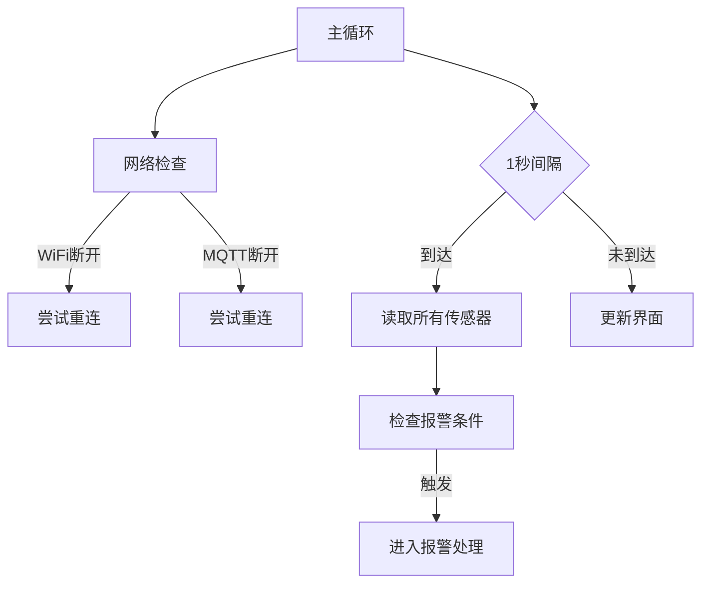

# 多功能环境监测仪

## 产品介绍


基于Wio Terminal的环境检测仪，集成温湿度/光照/噪声/加速度传感器，支持：
- 实时监控环境参数  
- WiFi数据上传至MQTT服务器  
- 本地显示屏多界面切换  
- 异常声光报警（温度超标/设备移动等）  
- NTP时间同步  

**应用场景**：温室大棚监测、粮仓监控、防盗预警、室内环境检测等

### 产品清单


- **核心硬件**  
  - [Wio Terminal](https://wiki.seeedstudio.com/Wio_Terminal_Intro/)  
  - [Grove温湿度传感器(DHT11)](https://wiki.seeedstudio.com/Grove-TemperatureAndHumidity_Sensor/)  
  - 双向端子连接线 + USB-C电缆  
- **软件工具**  
  - [MQTTX](https://mqttx.app/zh/features)  
  - [Arduino IDE](https://www.arduino.cc/en/software/#ide)  

---

## 产品规格
### Wio Terminal
| 类别        | 参数详情                                                                 |
|-------------|--------------------------------------------------------------------------|
| **核心配置** | ARM® Cortex®-M4 微控制器 (120MHz) + 192KB SRAM + 4MB 外部闪存           |
| **显示屏**   | 2.4英寸 (320×240像素)                                                   |
| **无线连接** | Wi-Fi: RTL8720DN模块 (2.4GHz/5GHz) + BLE 5.0                             |
| **内置传感器**| 光传感器(LTR-553ALS) + 6轴IMU(LSM6DS3TR-C) + 红外发射器(940nm)           |
| **交互控件** | 5向摇杆 + 2个可编程侧键 + 复位/电源按钮                                 |
| **扩展接口** | 1×Grove I²C接口 + 1×Grove数字/模拟接口 + Raspberry Pi 40-pin兼容GPIO     |
| **物理规格** | 72mm×57mm×12mm (ABS+PC材质)                                             |

### Grove-温湿度传感器(DHT11)
| 参数       | 规格                          |
|------------|-------------------------------|
| **温度**   | 0°C~50°C (±2°C, 分辨率0.1°C) |
| **湿度**   | 20%~90% RH (±5% RH)           |
| **采样率** | 1 Hz                          |
| **接口**   | Grove 4-pin (单总线协议)      |
| **供电**   | 5V/2A                         |
| **尺寸**   | 40mm×20mm×12mm (4.5g)         |

---

## 操作部署流程
1. **硬件连接**  
   - DHT11传感器 → Wio Terminal D0端口  
   - USB-C电缆连接PC  

2. **安装库文件**  

   在Arduino IDE中安装以下库：  
   ```arduino
   TFT_eSPI          // 驱动显示屏
   LIS3DHTR          // 加速度传感器
   DHT sensor library // 温湿度传感器 (需同时安装Adafruit Unified Sensor)
   PubSubClient      // MQTT通信
   NTPClient         // 时间同步
   ```

3. **配置开发环境**  
   - 添加开发板URL：`https://files.seeedstudio.com/arduino/package_seeeduino_boards_index.json`  

   - 安装Seeed Studio SAMD Boards支持包  


4. **上传代码**  
   ```arduino
   // 完整代码见第7章或GitHub:
   https://github.com/huakaiyang/Multifunctional-Environmental-Monitoring-Instrument/blob/main/code.txt
   ```


---

## 代码解析
### 核心功能架构


### 关键模块说明
1. **传感器初始化**  
   ```arduino
   TFT_eSPI tft;              // 显示屏驱动
   LIS3DHTR<TwoWire> lis;     // 加速度计(4G量程/50Hz采样)
   DHT dht(DHTPIN, DHTTYPE);  // 温湿度传感器
   ```

2. **网络与时间同步**  
   - NTP每60秒同步UTC+8时间  
   - WiFi/MQTT自动重连机制  
   ```arduino
   NTPClient timeClient(ntpUDP, "pool.ntp.org", 8 * 3600, 60000);
   mqttClient.connect(clientID);
   ```

3. **8种显示模式**  
   | 按键         | 功能               |
   |--------------|--------------------|
   | KEY_A        | 温度界面           |
   | KEY_B        | 湿度界面           |
   | KEY_C        | 光照界面           |
   | 五向键←       | 加速度界面         |
   | 五向键→       | 噪声界面           |
   | 五向键↓       | 返回综合界面       |
   | 五向键↑       | 日期时间界面       |

4. **报警系统**  
   - 阈值配置：  
     ```arduino
     const float TEMP_HIGH = 28.0;   // 温度上限
     const float ACCEL_THRESHOLD = 1.3; // 加速度变化阈值
     ```
   - 报警响应：  
     - 蜂鸣器播放高低音警报  
     - 屏幕显示红色警报界面  
     - 自动上传MQTT报警信息  

---

## 常见问题
❓ **上传代码失败**  
✅ 检查库安装是否完整，复制报错信息用AI工具分析  

❓ **屏幕卡住**  
✅ 向下拨动侧边按钮重启设备  

❓ **网络连接异常**  
✅ 修改代码中的WiFi/MQTT配置：  
```arduino
const char *ssid = "Your_WiFi_SSID";
const char *mqttServer = "Your_MQTT_Server";
```

---


## 总代码
```arduino
#include <TFT_eSPI.h>
#include "LIS3DHTR.h"
#include <DHT.h>
#include "rpcWiFi.h"
#include <PubSubClient.h>
#include <WiFiUdp.h>
#include <NTPClient.h>

// 引脚定义
#define DHTPIN 0
#define DHTTYPE DHT11

// 传感器对象初始化
TFT_eSPI tft;
LIS3DHTR<TwoWire> lis;
DHT dht(DHTPIN, DHTTYPE);

// 主循环核心逻辑
void loop() {
  // 1. 网络维护
  maintainNetworkConnection();
  
  // 2. 每秒读取传感器
  if (millis() - lastSensorRead > 1000) {
    readSensors();
    checkAlarmConditions();
    publishSensorData();
  }
  
  // 3. 界面更新
  if (currentState == INTEGRATED) drawIntegratedScreen();
  else if (currentState == DATETIME) updateDateTimeScreen();
  
  // 4. 报警处理
  if (isAlarmActive) handleAlarm();
}

// 完整代码详见GitHub仓库：
// https://github.com/huakaiyang/Multifunctional-Environmental-Monitoring-Instrument
```

> 提示：实际部署时需修改代码中的WiFi凭据和MQTT服务器地址，详细操作流程可参考《多功能环境监测仪用户手册》
```
